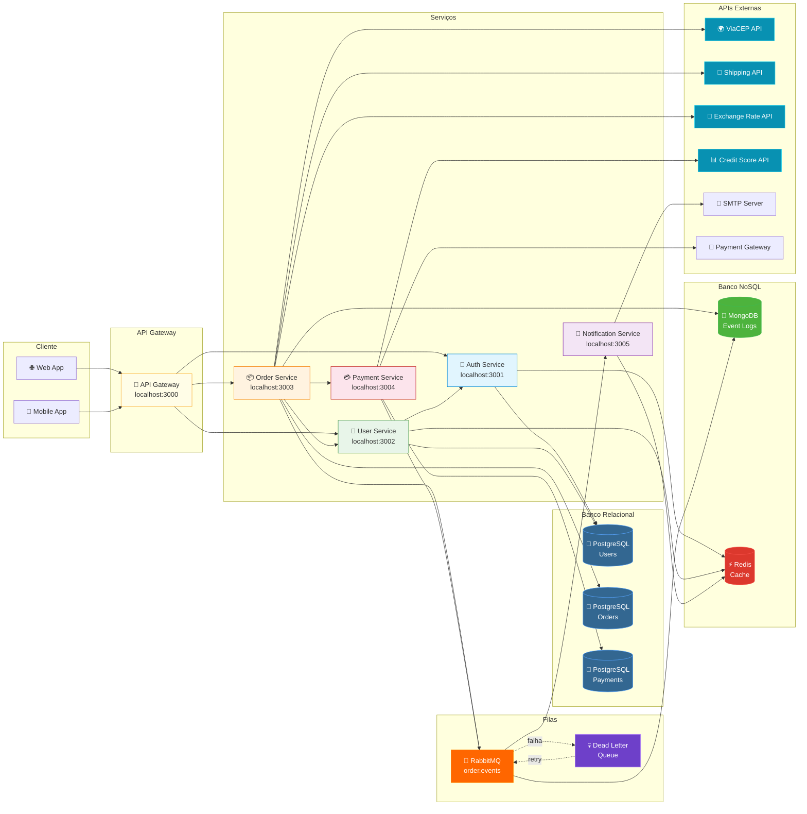

# Mapa de Integrações

Visão geral de todos os serviços, bancos de dados, filas e APIs externas.

## Endpoints por Serviço

| Serviço | Base URL | Endpoints |
|---------|----------|-----------|
| Auth | `localhost:3001` | `POST /auth/login`, `POST /auth/refresh`, `POST /auth/logout` |
| User | `localhost:3002` | `GET /users`, `POST /users`, `GET /users/:id`, `PUT /users/:id`, `DELETE /users/:id` |
| Order | `localhost:3003` | `POST /orders`, `GET /orders/:id`, `GET /orders/user/:userId`, `PUT /orders/:id/status` |
| Payment | `localhost:3004` | `POST /payments`, `GET /payments/:id`, `POST /payments/:id/refund` |
| Notification | `localhost:3005` | `POST /notifications/email`, `POST /notifications/push` |

## Bancos de Dados

| Banco | Tipo | Uso |
|-------|------|-----|
| 🐘 PostgreSQL | Relacional | Users, Orders, Payments (ACID, transactions) |
| 🍃 MongoDB | NoSQL Documento | Event logs, audit trail, analytics |
| ⚡ Redis | NoSQL Key-Value | Cache, sessions, rate limiting |

## Filas

| Fila | Exchange | Routing Key | Consumer |
|------|----------|-------------|----------|
| order.processing | order.events | order.created | Order Worker |
| order.fulfillment | order.events | order.confirmed | Fulfillment Worker |
| DLQ | dlx.order | # | DLQ Processor |

## APIs Externas

| API | Endpoint Mock | Descrição |
|-----|---------------|-----------|
| ViaCEP | `POST /external/cep` | Busca endereço por CEP |
| Shipping | `POST /external/shipping/calculate` | Calcula opções de frete |
| Exchange Rate | `POST /external/exchange-rate` | Cotação de moedas |
| Credit Score | `POST /external/credit-score` | Score de crédito |
