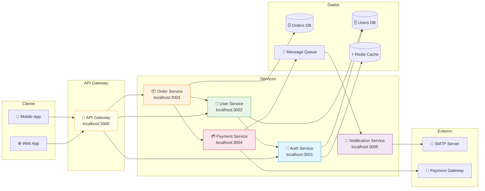

# Mapa de Integrações

Visão geral de todos os serviços e suas dependências.

## Endpoints por Serviço

| Serviço | Base URL | Endpoints |
|---------|----------|-----------|
| Auth | `localhost:3001` | `POST /auth/login`, `POST /auth/refresh`, `POST /auth/logout` |
| User | `localhost:3002` | `GET /users`, `POST /users`, `GET /users/:id`, `PUT /users/:id`, `DELETE /users/:id` |
| Order | `localhost:3003` | `POST /orders`, `GET /orders/:id`, `GET /orders/user/:userId`, `PUT /orders/:id/status` |
| Payment | `localhost:3004` | `POST /payments`, `GET /payments/:id`, `POST /payments/:id/refund` |
| Notification | `localhost:3005` | `POST /notifications/email`, `POST /notifications/push` |
